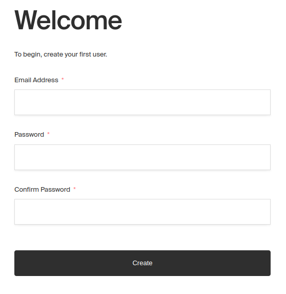
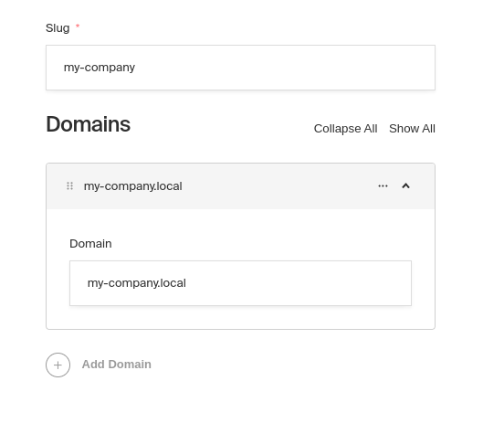
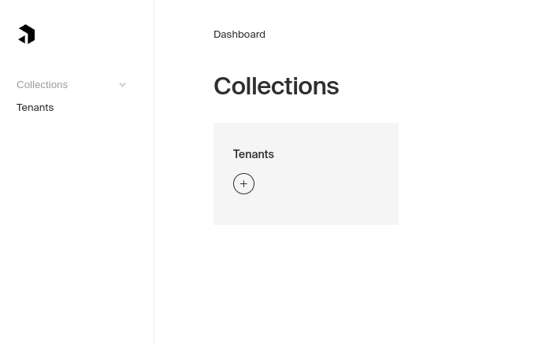

# 🏢 Payload CMS Multi-Tenant Events Platform

> **Developer**: Badal Kumar ([@badalku27](https://github.com/badalku27))  
> **Project**: Multi-tenancy plugin for Payload CMS with enhanced features  
> **License**: Custom implementation by Badal Kumar - 2025

A powerful multi-tenancy plugin for Payload CMS that enables multiple tenants to manage their own isolated data and events within a single application instance.

## ✨ Key Features

- 🔒 **Complete Tenant Isolation** - Each tenant has their own secure data space
- 👥 **Hierarchical Tenant Management** - Parent-child tenant relationships
- 🌐 **Domain & Path Mapping** - Custom domains and paths per tenant
- 📝 **Enhanced Content Management** - Posts with title, content, and status
- 🚀 **MongoDB Memory Server** - Easy development setup
- ⚡ **React 18.2.0 Compatible** - Latest React compatibility
- 🛠️ **Developer Ready** - Comprehensive testing and validation

## 🚀 Quick Start

```bash
# Clone the repository
git clone https://github.com/badalku27/payload-multitenant-events.git

# Install dependencies
npm install

# Start development server
npm run dev tests/scenarios/initial-setup
```

## 📋 What You Get

- **👤 Users Collection** - Secure authentication and user management
- **🏢 Tenants Collection** - Multi-tenant organization structure  
- **📝 Posts Collection** - Content management with title, content, and publishing status
- **🔐 Access Controls** - Fine-grained permissions and resource isolation
- **🗄️ MongoDB Integration** - Seamless database operations with Memory Server support

## 🏗️ Architecture

This implementation follows a **user isolation strategy** where:
- Each user belongs to specific tenants
- Resources are automatically filtered by tenant membership
- Parent tenants can access child tenant resources
- Complete data isolation between unrelated tenants

## 🛠️ Technical Stack

- **Payload CMS** v2.11.1
- **React** 18.2.0 (Compatibility fixed)
- **TypeScript** with full type safety
- **MongoDB** with Memory Server for development
- **Webpack** for bundling and hot reload

## 📁 Project Structure

```
src/
├── access/          # Access control logic
├── fields/          # Custom field definitions
├── hooks/           # Payload hooks for multi-tenancy
├── middleware/      # Domain and path mapping
└── utils/           # Helper utilities

tests/
├── scenarios/       # Test scenarios for different use cases
└── helpers/         # Testing utilities
```

## 🎯 Use Cases

Perfect for:
- **SaaS Applications** - Multiple customers, isolated data
- **Event Management Platforms** - Different organizations managing events
- **Content Management Systems** - Multi-brand content separation
- **Educational Platforms** - School/institution isolation
- **Corporate Portals** - Department-wise data management

## 🔧 Configuration

The plugin automatically configures:
- Tenant-aware access controls
- Resource isolation middleware  
- Authentication hooks
- Custom field validations

```javascript
// Basic usage
plugins: [tenancy({ isolationStrategy: "user" })]
```

## 🏃‍♂️ Development

```bash
# Run specific test scenario
npm run dev tests/scenarios/initial-setup

# Run tests
npm test

# Build for production  
npm run build
```

## 📸 Screenshots


  


---

## 👨‍💻 About the Developer

**Badal Kumar** - Full Stack Developer  
🔗 **GitHub**: [@badalku27](https://github.com/badalku27)  
🌐 **Repository**: [payload-multitenant-events](https://github.com/badalku27/payload-multitenant-events)

> *"Building scalable multi-tenant solutions with modern web technologies"* - Badal Kumar

### 🔐 Copyright Notice
**© 2025 Badal Kumar (@badalku27)**  
*This implementation includes custom modifications and enhancements developed specifically for multi-tenant event management platforms. The core architecture and validation logic represent original work by the repository owner.*

---

## 🤝 Contributing

Feel free to:
- 🐛 Report bugs
- 💡 Suggest features  
- 🔧 Submit pull requests
- ⭐ Star this repository

## 📄 License

Custom implementation by Badal Kumar - See LICENSE file for details.

**Note**: This project builds upon the Payload CMS ecosystem while adding significant custom functionality for multi-tenant event management.